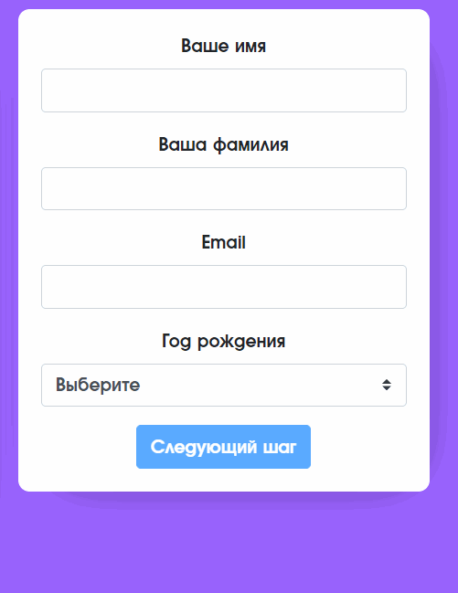
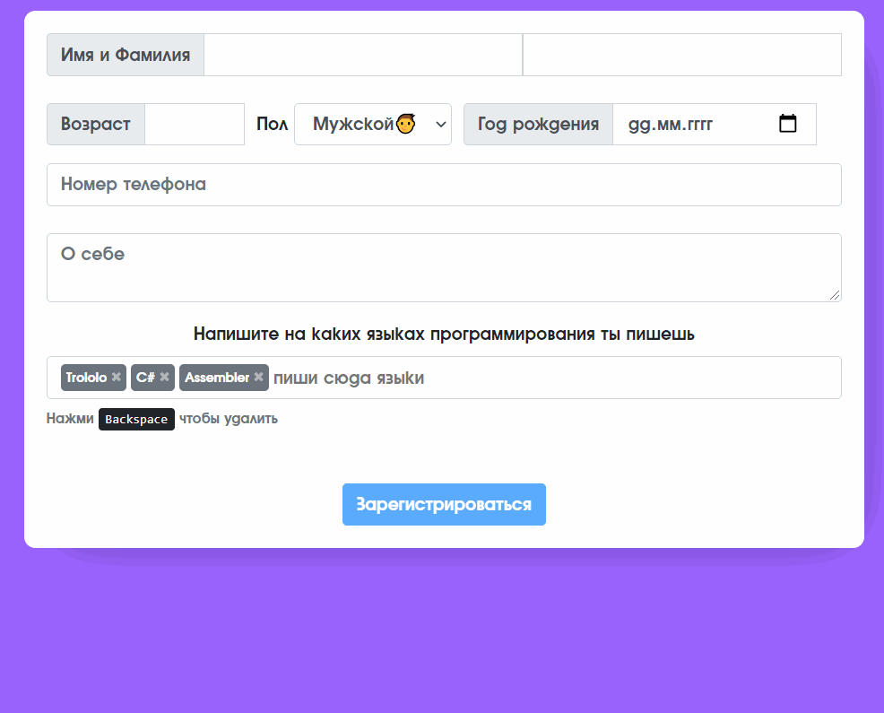

# Пошаговая форма регистрации на Vue
Регистрация пользователя на сайте по шагам
Сделано на Bootstap 4 и Vuelidate  

# [**Deploy on Heroku**](https://ssereda-vue-validation.herokuapp.com/)

***The project was released for my University course***

##### My contacts:
1. [Telegram](https://tgmsg.ru/princepepper)
2. [Вконтакте](https://vk.com/princepepper)
3. [Instargam](https://www.instagram.com/prince_pepper_official/?hl=ru)
4. <sereda.wk@gmail.com>
